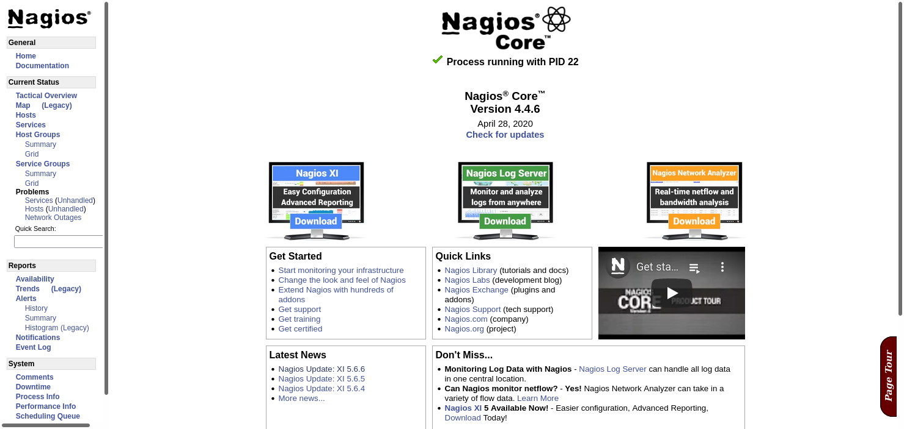
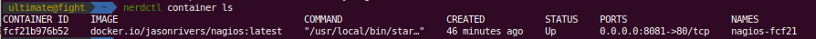

<p align="center">
  <a href="" rel="noopener">
 </a>
</p>

<h3 align="center">NAGIOS com RANCHER DESKTOP</h3>
<p align="center"> Como ter um nó nagios fácil com rancher desktop.
    <br> 
</p>
<div align="center">

[]()[](/LICENSE)

</div>

#

## CONTEÚDO

- [INSTALAÇÃO](#install)
- [ERROS](#erros)
- [OPCOES](#opcoes)

## INSTALAÇÃO DE NÓ DO NAGIOS NO RANCKER DESKTOP <a name = "install"></a>

```
nerdctl pull jasonrivers/nagios:latest

nerdctl run --name nagios4 -p 0.0.0.0:8080:80 jasonrivers/nagios:latest

```

</br>

### Credenciais do Nagios

User: `nagiosadmin`

Pass: `nagios`

<p align="center">
  <a href="" rel="noopener">
 </a>
</p>

- Se voce quiser parar, no terminal basta fazer CTRL + C.
  - Se quisier rodar novamente
  ```
  nerdctl run  -p 0.0.0.0:8080:80 jasonrivers/nagios:latest
  ```

### Entrar no Container

1. Veja a descrição do container: `nerdctl container ls`
   1. Veja o nome na coluna **< name >** do container.
2. Digitar o comando: `nerdctl exec -it nagios-fcf21 /bin/sh ` , ou , `nerdctl exec -it nagios-fcf21 /bin/bash `
   1. Para testar digite `cat /etc/hosts`

<p align="center">
  <a href="" rel="noopener">
 </a>
</p>

### Arquivos de Configuração

```
log_file=/opt/nagios/var/nagios.log

# You can specify individual object config files as shown below:
cfg_file=/opt/nagios/etc/objects/commands.cfg
cfg_file=/opt/nagios/etc/objects/contacts.cfg
cfg_file=/opt/nagios/etc/objects/timeperiods.cfg
cfg_file=/opt/nagios/etc/objects/templates.cfg

# Definitions for monitoring the local (Linux) host
cfg_file=/opt/nagios/etc/objects/localhost.cfg

# Definitions for monitoring a Windows machine
#cfg_file=/opt/nagios/etc/objects/windows.cfg

# Definitions for monitoring a router/switch
#cfg_file=/opt/nagios/etc/objects/switch.cfg

# Definitions for monitoring a network printer
#cfg_file=/opt/nagios/etc/objects/printer.cfg

#cfg_dir=/opt/nagios/etc/servers
#cfg_dir=/opt/nagios/etc/printers
#cfg_dir=/opt/nagios/etc/switches
#cfg_dir=/opt/nagios/etc/routers
```

## ERROS <a name = "erros"></a>

### (1) FATAL[0000] name "nagios4" is already used by ID "xxx"

```
nerdctl rm <name>
```

```
nerdctl rm nagios4
```

## OPCOES <a name = "opcoes"></a>

### Configuração

Se quiser subir o nagios com opcões de configuração, por exemplo com os plugins, voce pode fazer com o comando abaixo:

```
docker run --name nagios4  \
  -v /path-to-nagios/etc/:/opt/nagios/etc/ \
  -v /path-to-nagios/var:/opt/nagios/var/ \
  -v /path-to-custom-plugins:/opt/Custom-Nagios-Plugins \
  -v /path-to-nagiosgraph-var:/opt/nagiosgraph/var \
  -v /path-to-nagiosgraph-etc:/opt/nagiosgraph/etc \
  -p 0.0.0.0:8080:80 jasonrivers/nagios:latest
```

Existem varias variaveis como

| **Environamne Variable** |                    **Description**                    |
| :----------------------- | :---------------------------------------------------: |
| MAIL_RELAY_HOST          |                 Set Postfix relayhost                 |
| MAIL_INET_PROTOCOLS      |           set the inet_protocols in postfix           |
| NAGIOS_FQDN              | set the server Fully Qualified Domain Name in postfix |
| NAGIOS_TIMEZONE          |            set the timezone of the server             |

### Instalação do Vim no Nó (node nagios)

```
apt-get update
apt-get install vim -y
```

### Instalação do Outras ferramentas no Nó (node nagios)

```
apt-get update
apt-get install ntp ntpdate -y
```

`ntpdate a.ntp.br`

### Subir em background

nerdctl container run **_-d_**

```
  nerdctl container run -d --name nagios4 -p 0.0.0.0:8081:80 jasonrivers/nagios:latest
```

### Parar o container

```
nerdctl container stop <id_do_container>
```

### Plugins Extras

    - Nagios nrpe [http://exchange.nagios.org/directory/Addons/Monitoring-Agents/NRPE--2D-Nagios-Remote-Plugin-Executor/details]
    -
    - Nagiosgraph [http://exchange.nagios.org/directory/Addons/Graphing-and-Trending/nagiosgraph/details]
    -
    - JR-Nagios-Plugins - custom plugins I've created [https://github.com/JasonRivers/nagios-plugins]
    -
    - WL-Nagios-Plugins - custom plugins from William Leibzon [https://github.com/willixix/WL-NagiosPlugins]
    -
    JE-Nagios-Plugins - custom plugins from Justin Ellison [https://github.com/justintime/nagios-plugins]

# RANCHER

O Rancher é um software open source que conecta um conjunto de softwares necessários para o gerenciamento e orquestração de containers via web.

Um aplicativo de desktop de código aberto para Mac, Windows e Linux.
O Rancher Desktop executa o Kubernetes e o gerenciamento de contêineres em seu desktop. Você pode escolher a versão do Kubernetes que deseja executar. Você pode criar, enviar, extrair e executar imagens de contêiner usando containerd ou Moby (dockerd). As imagens de contêiner que você cria podem ser executadas pelo Kubernetes imediatamente sem a necessidade de um registro.

O Rancher aceita tanto hosts Linux de numvem pública, nuvem privada, servidores físicos ou máquinas virtuais, o Rancher não faz distinção em seu uso, implementando uma camada de serviços de infra-estrutura projetados especificamente para facilitar o gerenciamento de aplicações em containers.

O Rancher tem outros servicos como :

- rede, armazenamento, volumes, balanceador de carga, DNS.
  Outros Produtos

      https://k3s.io/: kubernetes para edge e IoT.
      https://rancher.com/rancher-cs/: Sistema Operacional Rancher.
      https://github.com/longhorn/longhorn/: Sistema de volume para containers.

<p align="center">
  <a href="" rel="noopener">
 </a>
</p>

## Arquitetura

<p align="center">
  <a href="" rel="noopener">
 </a>
</p>

# Build and Run Containers

<p align="center">
  <a href="" rel="noopener">
 </a>
</p>
